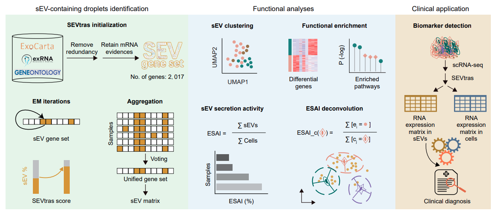

## SEVtras delineates small extracellular vesicles at droplet resolution from single-cell transcriptomes
SEVtras stands for <ins>sEV</ins>-con<ins>t</ins>aining d<ins>r</ins>oplet identific<ins>a</ins>tion in <ins>s</ins>cRNA-seq data.

You can freely use SEVtras to explore sEV heterogeneity at single droplet, characterize cell type dynamics in light of sEV activity and unlock diagnostic potential of sEVs in concert with cells.

<p align="center">
  
</p>
<p align="center">
  Overview of SEVtras.
</p>

### Prerequisites
    "numpy", "pandas", "scipy", "umap",
    "statsmodels", "gseapy", "scanpy"

### Installation
```bash
pip install SEVtras
```
We also suggest to use a separate conda environment for installing SEVtras.
```bash
conda create -y -n SEVtras_env python=3.7
source activate SEVtras_env
pip install SEVtras
```

### Basic Usage
Input for SEVtras is a cell-by-gene matrix. In the case of scRNA-seq dataset using 10X Genomics, we used `raw_feature_bc_matrix` directory generated by Cell Ranger as input. Output of SEVtras consists of the score of sEV signals and classification for each droplet. Such sEV information will be used for downstream analysis and as basis for the construction of the sEV secretion activity index (ESAI) for different cell types.

We implemented four functions for sEV recognizing and functional analyses. In SEVtras, `sEV_recognizer` recognizes sEV-containing droplets in the raw scRNA-seq data; `ESAI_calculator` calculates sEV secretion activity for samples and deconvolves these droplets to their original cell type and estimited corresponding sEV secretion activity; `cellfree_simulator` simulates transcriptional profile of cell free droplets in scRNA-seq; and `sEV_enrichment` performs GO enrichment for sEV data.

### Simple Example
The pipeline of SEVtras only composed two parts: sEV_recognizer and ESAI_calculator. 

Part I:
```bash
SEVtras.sEV_recognizer(sample_file='./tests/sample_file', out_path='./outputs', species='Homo')
```

Part II:
```bash
SEVtras.ESAI_calculator(adata_ev_path='./outputs/sEVs_SEVtras.h5ad', adata_cell_path='./outputs/adata_cell.h5ad', out_path='./outputs', Xraw=False, OBSsample='batch', OBScelltype='celltype')
```

Further tutorials please refer to  https://SEVtras.readthedocs.io/.
