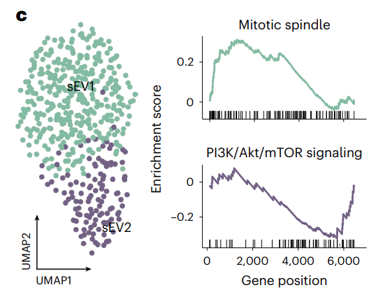

Part I *sEVs recognizing*
---------------------------------

Here, we used data in github ``tests`` directory as an example, and shown how SEVtras recognizing sEVs in scRNA-seq datasets. We have generated test data in ``h5ad`` format in github, and SEVtras also supports ``10x_mtx`` and ``h5`` data formats. 

**Note1:** The input droplet-gene matrix for SEVtras should be the raw data in this part; herein, the matrix should come from the ``raw_feature_bc_matrix`` directory in Cell Ranger **outs**\. 

**Note2:** This part requires parallel processing using the ``multiprocessing`` package. This package is currently not compatible with certain version of WSL on Windows 10. Running this part in Linux is preferred.

**Note3:** We don't recommend recognizing sEVs with a single sample. Inputting more similar samples  would lead to more reliable results.

We support two file input ways to run sEVs recognizing: 

.. code-block:: python

    ##1 if samples locate in one directory
    import SEVtras
    SEVtras.sEV_recognizer(input_path='./tests', sample_file='./tests/sample_file', out_path='./outputs', species='Homo')

The first parameter was the path of directory that contains all samples. Because these test files exists in our ``tests`` directory, so we used ``./tests``. The second parameter was the name of each sample in th directory row by row. If your data format is ``10x_mtx``\, SEVtras can automatically detect the directory of ``sample/outs/raw_feature_bc_matrix/`` (see parameter ``dir_origin``). 

*out_path* defines the output of SEVtras that is one h5ad file, named ``raw_SEVtras.h5ad``, with SEVtras score ('score') and sEV classification ('sEV') in the ``obs`` for all droplets, and one named ``sEVs_SEVtras.h5ad`` with only sEV-containing droplets. 

And *species* represents the species from which the sample was sequenced.

If samples locate in differet directories, we also supports another way to run SEVtras.

.. code-block:: python

    ##2 if samples locate in differet directories
    import SEVtras
    SEVtras.sEV_recognizer(sample_file='./tests/sample_file', out_path='./outputs', species='Homo')

Here, first parameter was the abosulte path of each sample row by row.

The result of sEV_recognizer can be displayed as follows: 

    
