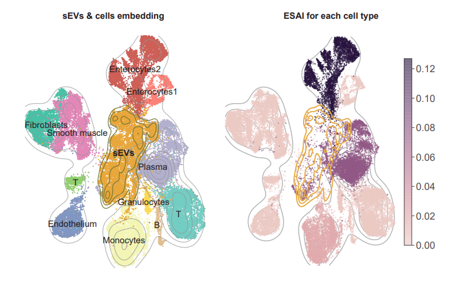

Part II *ESAI calculating*
---------------------------------

With the output of ``SEVtras.sEV_recognizer`` in :doc:`/Part I sEVs recognizing` and cell matrix with cell type, SEVtras can track each sEV to original cell type and calculate sEV secretion activity index (ESAI).

**Note1:** The input cell matrix should contain sample and cell type information in the ``obs`` of adata. 

**Note2:** This command can be compatible to all platform, including Jupyter on Windows. 

SEVtras provides function ``ESAI_calculator`` to evaluate dynamic of cellular sEV secretion activity. 

.. code-block:: python

    import SEVtras
    SEVtras.ESAI_calculator(adata_ev_path='./outputs/sEVs_SEVtras.h5ad', adata_cell_path='./outputs/adata_cell.h5ad', out_path='./outputs', Xraw=False, OBSsample='batch', OBScelltype='celltype')

The first two parameters represent the path to sEV- and cell- anndata objects. 

The third parameter specifies the path of the ``ESAI_calculator`` outputs. The outputs include:  

-  an adata file combining both ``adata_ev`` and ``adata_cell``, named *SEVtras_combined.h5ad*; 
-  two csv files calculating the sEV secretion activity index at the sample level (ESAI) and cell type level (ESAI_c), named  *ESAI_sample.csv* and *ESAI_celltype.csv*\; 
-  one pdf file embedding sEVs and cells in a umap , named *SEVumap.pdf*\; 
-  and two pdf files plotting the ESAI_c in a umap, named *ESAIumap.pdf* and *ESAIumap_sample.pdf*\. 

The fourth parameter means whether to use the raw object in the ``adata_cell`` or not. If ``adata_cell`` has been filtered or normalized, please set ``Xraw=True``, and ``adata_cell.raw`` will be used (Note: save raw ``adata_cell`` as ``adata_cell.raw`` before filtering). 

The last two parameters define which index represents the sample and cell type information in the ``obs`` of adata. By default, SEVtras uses the index of ``batch`` and ``celltype`` in the ``obs`` of ``adata_cell``\. We can change the index with the parameters and *OBSsample* and *OBScelltype*\. 

The original cell type for each droplet listed in the ``obsm`` of ``SEVtras_sEVs.h5ad`` indexed as ``source``.
And *ESAI_celltype.csv* includes values of ESAI for each cell type as follows:

+------------+------------+-------------+------------+-----------+
|      0     |  celltype0 |  celltype1  |  celltype2 | celltype3 |
+============+============+=============+============+===========+
| test1_h5ad |    4.25    | 0.090909091 |      0     |     0     |
+------------+------------+-------------+------------+-----------+
| test2_h5ad |      0     |    0.0625   |     1.5    |   1.9375  |
+------------+------------+-------------+------------+-----------+

The result of *SEVumap.pdf* and *ESAIumap.pdf* is similar to the following: 

    
